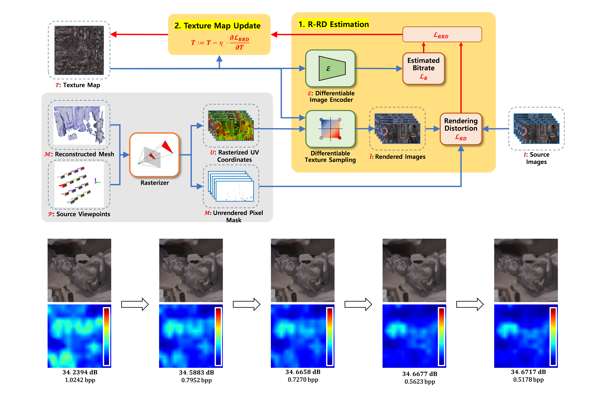

# Rate-Rendering Distortion Optimized Preprocessing for Texture Map Compression of 3D Reconstructed Scenes
This repository implements ["Rate-Rendering Distortion Optimized Preprocessing for Texture Map Compression of 3D Reconstructed Scenes"]

|  |
|:--:|
| *Architecture of the proposed rate-rendering distortion (R-RD) optimized preprocessing method for texture map compression* |

## Abstarct

The UV map of a reconstructed mesh from real-world multiview images is often highly fragmented, which can cause severe color and structural discontinuities in the texture map. This fragmentation can degrade the compression performance of the texture map, resulting in texture bleed artifacts in the rendered image. While it is possible to improve compression performance by smoothing the texture map through texture padding methods, this approach only improves color continuities, not structural continuities, and is not an optimized method from a rate-distortion perspective.
To address these issues, this paper proposes a rate-rendering distortion (R-RD) optimized preprocessing method for texture map compression. The proposed method is designed with a fully differentiable architecture consisting of a differentiable image encoder and differentiable texture sampling. The differentiable image encoder is used to estimate the bitrate of the texture map, and differentiable texture sampling is used to measure the rendering distortion of the texture map. Through iterative joint optimization of the estimated bitrate and the measured rendering distortion, the proposed method improves the compression efficiency of the texture map.
Experimental results reveal that the proposed method not only increases color continuities but also naturally increases structural continuities in the texture map and blurs high-frequency components unfavorable to compression. Thus, the proposed method demonstrates bitrate savings of at least 11.34\%, 13.51\%, and 10.04\% compared to texture padding methods in texture map compression results on JPEG, HEVC, and VVC, respectively.
    
## Requirements
+ Python (3.6.5+)
  + Numpy 
  + Pytorch 
  + Nvdiffrast
  + tqdm
